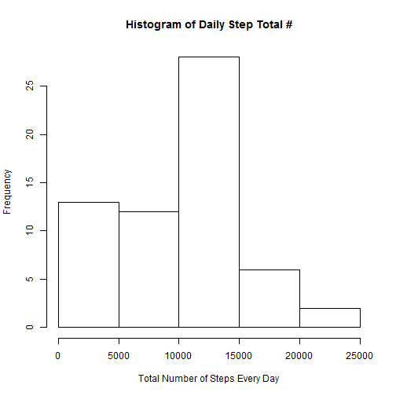
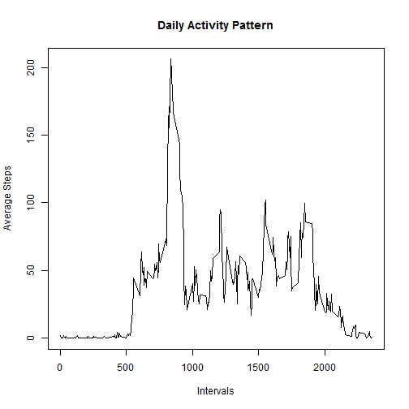
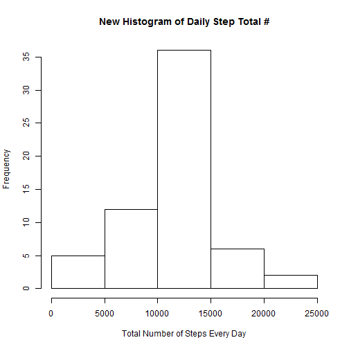
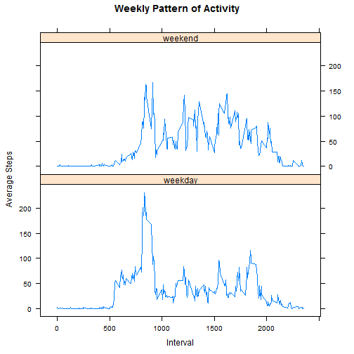

Data Science Course 5, Week 2 Project
=====================================
In this project, we are analyzing personal activity data from an individual via a monitoring device. To be more accurate, numbers of steps taken were counted in 5-min intervals throughout the days from October 1 to November 30, 2012.

First, I download the data to my local repository (set as working directory) and read it:


```r
setwd("D:/JHSPH Academics/Coursera/Course 5_Reproducible Research/Week 2/RepData_PeerAssessment1")
ACTIVITY=read.csv("activity.csv")
```

The dataframe "ACTIVITY" is composed of 3 columns, "steps","date" and interval. There are quite some missing values (shown as "NA") for "steps". In the first part of the project, we will omit these values.

==========================
Part I: Omit missing values and calculate total numbers of steps taken every day, make histogram, and calculate mean/median values

We copy the original dataframe into a new one, "ACTIVITY 1", and convert the dates into "date" format, followed by splitting the dataframe by dates, calculating total steps for each date, and making a histogram: 

```r
ACTIVITY1=ACTIVITY
ACTIVITY1$date=as.Date(as.character(ACTIVITY1$date))
SPLITACT=split(ACTIVITY1,ACTIVITY1$date)
TTTEST=lapply(SPLITACT,function(x) sum(x[,"steps"],na.rm=TRUE))
TTTESTN=as.numeric(TTTEST)
hist(TTTESTN,xlab="Total Number of Steps Every Day",ylab="Frequency",main="Histogram of Daily Step Total #")
```



And then we calculate the mean and median values of the daily total step numbers:

```r
mean(TTTESTN)
```

```
## [1] 9354.23
```

```r
median(TTTESTN)
```

```
## [1] 10395
```

Please keep in mind that we omitted all missing values before making the calculations. We will check later whether or not the total, mean and median values change when we fill in the missing places with some data.

----------------------------------
Part II: Find daily activity pattern

Again, we create a new dataframe "ACTIVITY2" to avoid directly working on original one. We will split it by interval this time and plot daily activity pattern:


```r
ACTIVITY2=ACTIVITY1
SPLITACT2=split(ACTIVITY2,ACTIVITY2$interval)
MEANTEST=lapply(SPLITACT2, function(x) mean(x[,"steps"],na.rm=TRUE))
X1=unique(ACTIVITY2$interval)
Y1=as.numeric(MEANTEST)
plot(X1,Y1,type="l",xlab="Intervals",ylab="Average Steps", main="Daily Activity Pattern")
```



In order to figure out the exact 5-min interval for maximum average steps, we write a simple for loop:

```r
max(Y1)
```

```
## [1] 206.1698
```

```r
ACT2=data.frame(X1,Y1)
nrow(ACT2)
```

```
## [1] 288
```

```r
for (i in 1:nrow(ACT2)) {
  if (ACT2$Y1[i]==max(ACT2$Y1)) {
    print(ACT2$X1[i])
  }
}
```

```
## [1] 835
```
And we can find that the maximum average steps are taken by the 835 interval.

-----------------------------------------------------------------------------
Part III: Imput missing values
As mentioned, we omitted missing values before calculations in the first part. Here, we use a different strategy. We fill up the missing places with the corresponding 5-min interval values, and do the calculation/make the histogram again to see if there were any diffrences. 
Again, we created a new copy of dataframe, "ACTIVITY3". First, we need to find out how many missing values are out there:

```r
ACTIVITY3=ACTIVITY1
k=0
for (i in 1:nrow(ACTIVITY3)) {
   if (is.na(ACTIVITY3$steps[i])==TRUE) {
    k=k+1
  }
}
k
```

```
## [1] 2304
```

So there are totally 2304 missing values.

Now let's fill them up with corresponding 5-min interval averages:

```r
for (i in 1:nrow(ACTIVITY3)) {
  if (is.na(ACTIVITY3$steps[i]==TRUE)) {
    for (j in 1:nrow(ACT2)) {
      if (ACTIVITY3$interval[i]==ACT2$X1[j]) {
        ACTIVITY3$steps[i]=round(ACT2$Y1[j],0)
      }
    }
  }
}
```

Please notice that we rounded the step #s to integer.
The data splitting, histogram drawing and mean/median calculation are the same as in Part I:

```r
SPLITACT3=split(ACTIVITY3,ACTIVITY3$date)
TTTEST3=lapply(SPLITACT3, function(x) sum(x[,"steps"]))
TTTEST3N=as.numeric(TTTEST3)
hist(TTTEST3N,xlab="Total Number of Steps Every Day",ylab="Frequency",main="New Histogram of Daily Step Total #")
```



```r
mean(TTTEST3N)
```

```
## [1] 10765.64
```

```r
median(TTTEST3N)
```

```
## [1] 10762
```

As we could notice, the calculated values do change, but not very dramatically; indicating that imputting 5-min interval averages might be an acceptable strategy to deal with the problem of missing data in our case.

--------------------------------------------------
Part IV: Find potential differences on weekday and weekend patterns:
As could be assumed, there might be some difference in activity patterns based on weekday/weekend status. Let's find it out here.
Again, another copied dataframe "ACTIVITY4". We set a new variable "WEEKDAY" here:

```r
ACTIVITY4=ACTIVITY3
ACTIVITY4$WEEKDAY=as.character("BLANK",length=nrow(ACTIVITY4))
for (i in 1:nrow(ACTIVITY4)) {
  if (weekdays(ACTIVITY4$date[i])=="Sunday" || weekdays(ACTIVITY4$date[i])=="Saturday") {
    ACTIVITY4$WEEKDAY[i]="weekend"
  }
  else {ACTIVITY4$WEEKDAY[i]="weekday"}
}
```

In order to finally make a panel plot as required, we need to do a little trick here. First, we create subsets of the dataframe by "WEEKDAY"; then we split both subsets by "intervals", calculate the mean values for each, and then we re-merge them and convert the "WEEKDAY" varible to "factor":

```r
ACT4WD=subset(ACTIVITY4,ACTIVITY4$WEEKDAY=="weekday")
ACT4WE=subset(ACTIVITY4,ACTIVITY4$WEEKDAY=="weekend")

SPLACT4WD=split(ACT4WD,ACT4WD$interval)
SPLACT4WE=split(ACT4WE,ACT4WE$interval)

MEAN4WD=lapply(SPLACT4WD, function(x) mean(x[, "steps"]))
MEAN4WE=lapply(SPLACT4WE, function(x) mean(x[, "steps"]))

PANEL4WD=data.frame(X4=unique(ACT4WD$interval),Y4=as.numeric(MEAN4WD),WEEKDAY=as.character("weekday",length=length(MEAN4WD)))
PANEL4WE=data.frame(X4=unique(ACT4WE$interval),Y4=as.numeric(MEAN4WE),WEEKDAY=as.character("weekend",length=length(MEAN4WE)))

PANEL4=rbind(PANEL4WD,PANEL4WE)
PANEL4$WEEKDAY=as.factor(PANEL4$WEEKDAY)
```

And finally, we use the LATTICE plotting system to make the panel plot:

```r
library(lattice)
xyplot(Y4 ~ X4 | WEEKDAY, data=PANEL4, layout = c(1, 2),type="l",xlab="Interval",ylab="Average Steps", main="Weekly Pattern of Activity")
```



As we can see, the activities on weekdays appear to peak at ~(800-900) intervals and dramatically decrease after that; while on the weekend, the pattern is more "averaged" over the day.

Enjoy!


